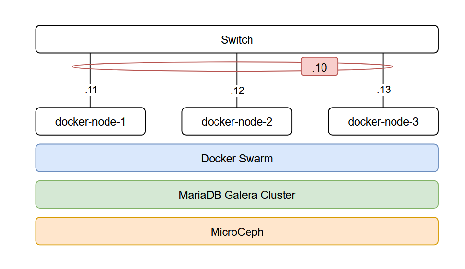

J'ai commencé il y a plus d'un mois à déployer mon propre cluster Docker Swarm dans mon homelab pour gérer tous mes conteneurs Docker qui jusque là ne tournaient que dans des machines virtuelles dans mon environnement Proxmox. Il n'y avait aucune protection en cas de perte d'un hyperviseur ou d'une machine virtuelle, et pire encore : pas de backup. N'oublions pas aussi le nombre de base de données que nous déployons pour chaque application qui elles mêmes ne sont pas souvent sauvegardés.

Le cluster que j'ai déployé résout la majorité des problèmes : Docker Swarm peut faire basculer des conteneurs de noeuds, MicroCeph conserve les données des conteneurs pour qu'il puissent se relancer sur un autre noeud, MariaDB Galera fonctionne comme l'unique serveur pour les bases de données et keepalived pour n'avoir qu'une IP à joindre pour contacter le cluster.

J'ai déployé ce cluster à la main sur 3 mini-pc Dell Wyse 5070 modifiés, ayant tous 4 coeurs (Intel Pentium J5005), 16Go de RAM, 256Go de SSD en SATA M.2 et un seul port RJ45 en 1Gbits. La consommation globale en électricité est relativement basse et les performances sont raisonnables et suffisantes pour mon besoin. Chaque noeud Docker sera installé avec Ubuntu 24.04 LTS avec un utilisateur lambda ayant les droits sudo et un partionnement classique LVM du disque.



# Mise en place de Docker Swarm
## Installation de Docker
Je vais commencer par déployer le cluster Docker Swarm. Pour cela, il faudra d'abord installer Docker sur chaque noeud. Je vais suivre la documentation de Docker qui est la suivante (que vous pouvez retrouver [ici](https://docs.docker.com/engine/install/ubuntu/#install-using-the-repository) et [ici](https://docs.docker.com/engine/install/linux-postinstall)):

1. Installation du repository Docker :
```bash
# Add Docker's official GPG key:
sudo apt update
sudo apt install ca-certificates curl
sudo install -m 0755 -d /etc/apt/keyrings
sudo curl -fsSL https://download.docker.com/linux/ubuntu/gpg -o /etc/apt/keyrings/docker.asc
sudo chmod a+r /etc/apt/keyrings/docker.asc

# Add the repository to Apt sources:
sudo tee /etc/apt/sources.list.d/docker.sources <<EOF
Types: deb
URIs: https://download.docker.com/linux/ubuntu
Suites: $(. /etc/os-release && echo "${UBUNTU_CODENAME:-$VERSION_CODENAME}")
Components: stable
Signed-By: /etc/apt/keyrings/docker.asc
EOF

sudo apt update
```

2. Installer les packages :
```bash
sudo apt install docker-ce docker-ce-cli containerd.io docker-buildx-plugin docker-compose-plugin
```

3. Ajouter l'utilisateur au groupe Docker
```bash
sudo usermod -aG docker $USER
```

## Création du cluster

Une fois Docker installé, j'initalise le cluster Docker Swarm. Si le système comporte plusieurs interfaces réseaux (pour ceux qui auraient une interface interne dédié par exemple), il faudra spécifier l'ip avec `--advertise-addr <ip-addr>`. La documentation de Docker Swarm est disponible [ici](https://docs.docker.com/reference/cli/docker/swarm/init/).
```bash
docker swarm init
```

Lors de l'initialisation du cluster, il va fournir une commande que je vais exécuter sur les deux autres noeuds :
```bash
docker swarm join --token SWMTKN-1-32urqmbj3ce02el6bbgtlefgk0mjbf17rat5btac2blpoup9f0-5ddwpb9j3g76rfauparnnjleu 10.1.1.11:2377
```

Ensuite, j'élève les deux autres noeuds comme "Master" du cluster : si le seul noeud Master tombe, alors les "Worker" ne pourront rien faire, sauf faire tourner les conteneurs déjà en cours.
```bash
docker node promote <node-name>
```

# Mise en place de MicroCeph
# Installation
MicroCeph est une version allégé de Ceph, qui est téléchargeable depuis "Snap". Je vais l'installer sur chaque noeud :
```bash
sudo snap install microceph
sudo snap refresh --hold microceph
```

Puis sur le premier noeud, je vais initialiser la base de donnée et vérifier ensuite que le cluster est OK :
```bash
sudo microceph cluster bootstrap
sudo microceph status
```

Ensuite, je vais créer le token pour les deux autres noeuds à ajouter sur le premier noeud :
```bash
sudo microceph cluster add docker-node-2
sudo microceph cluster add docker-node-3
```

Et après lancer la commande suivante sur les deux autres noeuds
```bash
# Sur docker-node-2
sudo microceph cluster join <token-docker-node-2>
# Sur docker-node-3
sudo microceph cluster join <token-docker-node-3>
```

Maintenant qu'ils sont tous dans le cluster de MicroCeph, je vais créer un OSD (un disque) de 100Go sur chaque noeud.
```
sudo microceph disk add loop,100G,1
```

On vérifie par la suite que MicroCeph à bien pris en compte chaque OSD et qu'il est en bonne santé :
```bash
benjamin@docker-node-1:~$ sudo microceph.ceph status
cluster:
    id:     be9fd6a9-7bfc-4e9a-9d6d-3daa1d7be688
    health: HEALTH_OK

  services:
    mon: 3 daemons, quorum docker-node-1,docker-node-2,docker-node-3 (age 106m)
    mgr: docker-node-1(active, since 106m), standbys: docker-node-3, docker-node-2
    mds: 1/1 daemons up, 2 standby
    osd: 3 osds: 3 up (since 106m), 3 in (since 24h)

  data:
    volumes: 1/1 healthy
    pools:   3 pools, 145 pgs
    objects: 3.47k objects, 133 MiB
    usage:   743 MiB used, 299 GiB / 300 GiB avail
    pgs:     145 active+clean
```

Comme tout va bien, je vais créer mon espace CephFS "Docker" :
```bash
sudo microceph.ceph fs volume create docker
``` 

## Configuration du montage
Sur chaque noeud, je dois installer un package nécessaire au montage d'un volume CephFS, et également créer mon point de montage :
```bash
sudo apt install ceph-common
sudo mkdir /mnt/cephfs
```

Ceph à besoin des fichiers de configuration de MicroCeph, mais il ne sont pas stockés au même endroit : je vais simplement créer des liens symboliques :
```bash
sudo ln -sf /var/snap/microceph/current/conf/ceph.client.admin.keyring /etc/ceph/ceph.client.admin.keyring
sudo ln -sf /var/snap/microceph/current/conf/ceph.keyring /etc/ceph/ceph.keyring
sudo ln -sf /var/snap/microceph/current/conf/ceph.conf /etc/ceph/ceph.conf
```

Pour ne pas divulger le "secret" pour se connecter au volume Ceph, je vais le stocker dans un fichier dédié :
```bash
sudo ceph auth get-key client.admin | sudo tee /etc/ceph/admin.secret
sudo chmod 600 /etc/ceph/admin.secret
```

Et enfin ajouter le montage du volume dans `/etc/fstab` :
```
# Montage CephFS - Volume Docker
<ip-docker-node-1>,<ip-docker-node-2>,<ip-docker-node-3>:/ /mnt/cephfs ceph name=admin,secretfile=/etc/ceph/admin.secret,fs=docker,_netdev,noatime,x-systemd.automount,x-systemd.mount-timeout=30 0 0
```

Docker démarre souvent plus vite que MicroCeph/Ceph, ce qui peut amener à des petits soucis d'accès au point de montage pour les conteneurs qui veulent y accéder. Je vais donc créer une configuration dans Docker qui est la suivante dans `/etc/systemd/system/docker.service.d/cephfs-dep.conf` :
```bash
[Unit]
Requires=mnt-cephfs.automount
After=mnt-cephfs.automount

Wants=mnt-cephfs.mount
```

Ce fichier agit comme une dépendance, et donc Docker pourra "provoquer" le montage du volume Docker sur `/mnt/cephfs`.

# Mise en place de MariaDB Galera

Le fonctionnement en haute disponibilité de MariaDB est particulier : là où de nombreuses bases de données vont avoir un "Master" et plusieurs "Workers", MariaDB Galera utilise uniquement des "Masters". Chaque noeud est donc en capacité de prendre en compte une requête SQL.

Pour faire fonctionner MariaDB Galera, il faudra installer le serveur MariaDB et rsync sur chaque noeud. Le service doit rester à l'arrêt pour configurer celui-ci.

```
sudo apt update
sudo apt install mariadb-server rsync -y
sudo systemctl stop mariadb
```


Dans `/etc/mysql/mariadb.conf.d`, je vais garder une copie de 60-galera.cnf, puis "overwrite" ma configuration en indiquant les IPs de chaque noeud. Je remplace `<ip-node>` et `<name-node>` par le nom et l'IP du noeud que je configure.

```bash
#60-galera.cnf
[galera]
# Activation de Galera
wsrep_on                 = ON
wsrep_provider           = /usr/lib/galera/libgalera_smm.so

# Liste des 3 noeuds
wsrep_cluster_address    = "gcomm://<ip-docker-node-1>,<ip-docker-node-2>,<ip-docker-node-3>"
wsrep_cluster_name       = "galera_cluster"

# Configuration spécifique au noeud courant
wsrep_node_address       = "<ip-node>"
wsrep_node_name          = "<name-node>"

# Méthode de synchronisation initiale
wsrep_sst_method         = rsync

default_storage_engine   = InnoDB
innodb_autoinc_lock_mode = 2
innodb_force_primary_key = 1
binlog_format            = row
```

Sur le premier noeud, je vais boostrap le cluster :
```bash
sudo galera_new_cluster
sudo systemctl status mariadb
```

Si cela à fonctionné sur le premier noeud, alors je peux lancer sur les deux autres :
```bash
sudo systemctl start mariadb
sudo systemctl enable mariadb
```

Sur n'importe quel noeud, je peux vérifier l'état du cluster avec les deux commandes SQL suivante :
```sql
SHOW STATUS LIKE 'wsrep_cluster_size';
SHOW STATUS LIKE 'wsrep_cluster_status';
```

# Installation de Keepalived
Pour atteindre MariaDB ou d'autres services depuis une seule et unique adresse IP, je vais utiliser keepalived qui fournira une "VIP" (Virtual IP) via le protocole VRRP.

J'installe les packages de Keepalived via APT :
```bash
sudo apt install -y keepalived
```

Sur chaque noeuds, je vais créer la configuration de Keepalived dans `/etc/keepalived/keepalived.conf`, en modifiant l'interface (varie selon les systèmes et installations), la priorité (90 pour le docker-node-2, 80 pour le docker-node-3), la VIP que je souhaite utiliser et enfin le "secret".
```
vrrp_instance VI_1 {
    state MASTER
    interface <interface>          
    virtual_router_id 51
    priority 100             
    advert_int 1
    authentication {
        auth_type PASS
        auth_pass <secret> 
    }
    virtual_ipaddress {
        10.1.0.10
    }
}
```

Et enfin, activer et démarrer keepalived :
```bash
sudo systemctl enable --now keepalived
```

# Pour aller plus loin

*Un lien vers mon repository GitHub qui regroupe toutes les configurations sera disponible prochainement.*